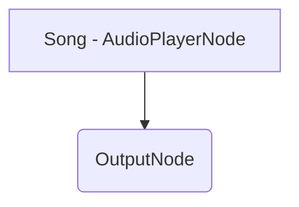
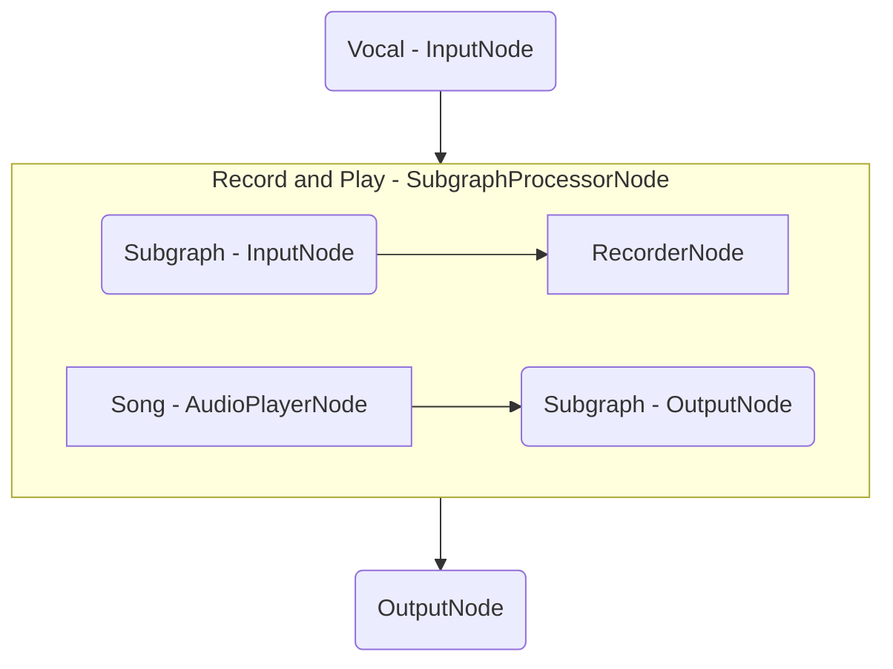
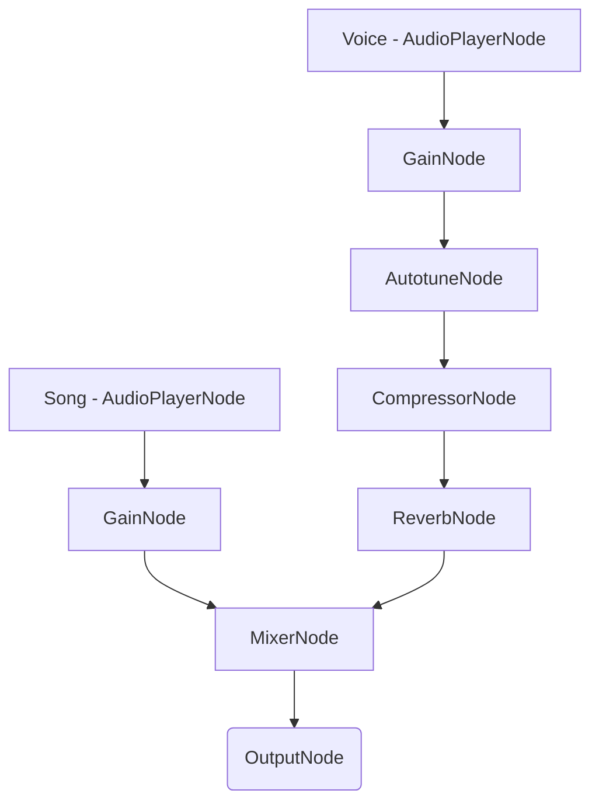

# Karaoke App - Android

## Important Links

<a href="https://docs.switchboard.audio/docs/examples/karaoke-app/" target="_blank">Find more info on the Karaoke App HERE</a>

<a href="https://docs.switchboard.audio/" target="_blank">Find more info on the Switchboard SDK HERE</a>

## About Karaoke App

*Karaoke apps rank among the most popular audio-related applications within the mobile app marketplace. Who doesn't like a good karaoke party?*

*The idea behind these apps is straightforward, yet their development can become highly complex without a fundamental understanding of audio programming. For example making sure that the backing track is in sync with the recording is not straightforward task.*

*Fortunately, the process of creating a karaoke app is significantly simplified when using the SwitchboardSDK. This example will illustrate how you can easily construct one by essentially connecting various audio nodes.*

## Features

The app has the following **features**:

- Vocal recording over a backing track
- Ability to use a volume mixer after recording
- Ability to apply different effects after recording
- Sharing of the completed recording

It consists of the following **screens**:

- ***Song List:*** Listen to the available songs, and choose one
- ***Sing:*** Play the selected song and record your voice over it
- ***Mixing:*** Apply effects on your voice and use the volume mixer to achieve perfect balance between your voice and the song. Export and share the rendered file.

You can find more info about the screens below.

### Song List Screen

The Song List screen contains a list of available songs.

You can play and pause and different songs, and press the "Sing" button when you have selected your favorite.

#### Audio Graph

The audio graph for the Song List screen contains a player node that is routed to the speaker output:

### Sing Screen

The Sing screen consists of a progress bar for the backing track, a start / finish recording button and a lyrics view.

When you are ready to sing, press the Start button. This will start the playback of the backing track, and your vocal input is recorded.
Press finish when you want to stop singing. This will bring you to the Mixer screen.

On this screen please use wired headphones for the best experience!

#### Audio Graph

To make sure that the recording is in sync with the audio playback we use a `SubgraphProcessorNode`. This ensures that the RecorderNode and the AudioPlayerNode for the backing track is started at the same time.

### Mixer Screen

The Mixer screen consists of a seek bar for the player which allows you to seek forward and backward in the mix of your vocal input and the backing track.

It also has volume sliders for the vocals and backing track to make you able to mix volumes to your liking.

You can also enable different effects on the vocals by using the effect switches.

When you are done with the mixing and editing you can save and share your recording using your favorite app by tapping the Export button.

#### Audio Graph

The same audio graph will be used with the **Offline Graph Renderer** to render the final mix to an output file which can be shared.

## Important Links

<a href="https://docs.switchboard.audio/docs/examples/karaoke-app/" target="_blank">Find more info on the Karaoke App HERE</a>

<a href="https://docs.switchboard.audio/" target="_blank">Find more info on the Switchboard SDK HERE</a>
